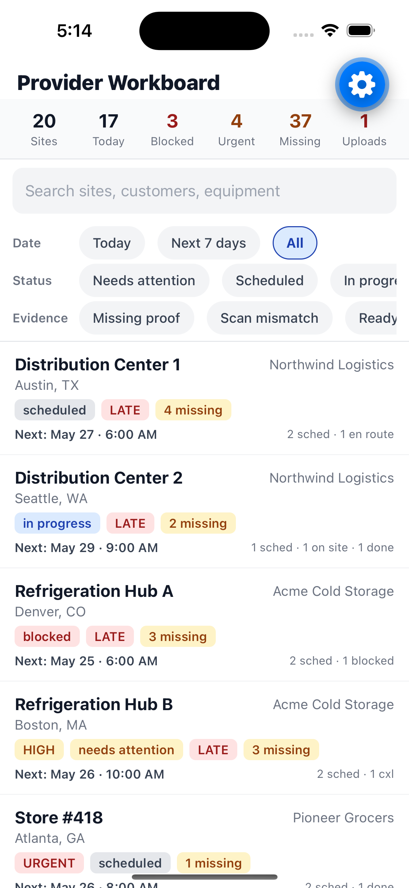

# Provider Workboard

React Native (Expo + TypeScript) take-home for **Orbit Field Services**. A mobile workflow for field providers — virtualized site list, stacked detail sheets, camera evidence capture, barcode/QR scan verification, accelerometer-based motion check, foreground location capture, and a persisted retry queue for failed uploads.

The implementation closely follows the spec in `HIRING_REACT_NATIVE_TAKE_HOME.md`. See [AGENT_LOG.md](./AGENT_LOG.md) for how coding agents were used.

## Prerequisites

This project was developed and verified on the following environment:

| Tool | Version used | Required |
|---|---|---|
| Node.js | v23.9.0 | `^20.19.4 \|\| ^22.13.0 \|\| ^24.3.0 \|\| >= 25.0.0` (per Expo SDK 56) |
| npm | 10.9.2 | bundled with Node |
| Expo SDK | 56.0.4 | resolved automatically by `npm install` |
| React Native | 0.85.3 | resolved automatically |
| TypeScript | 6.0.x | resolved automatically |
| macOS | any recent | required for iOS Simulator only |
| Xcode | 15+ with iOS 18.6 SDK | required for `i` / iOS Simulator only |
| iOS Simulator | iPhone 16 / iOS 18.6 (what I tested on) | any device booted in Simulator works |
| Android Studio | optional | required only if you want `a` / Android Emulator |
| Expo Go (device) | latest | only needed if testing on a physical device |

> **Note on Node 23:** The build runs fine on Node 23.9.0 even though Expo SDK 56 officially recommends 20/22/24+. If you hit any peer-dep warnings, prefer Node 22 LTS (`^22.13.0`).

## Setup (first time)

```bash
# 1. Clone the repo
git clone git@github.com:pavani1518/react-native-take-home-downstream.git
cd react-native-take-home-downstream

# 2. (Optional) Use a supported Node version
# nvm install 22 && nvm use 22

# 3. Install dependencies
npm install

# 4. (iOS only) Boot a simulator once so `i` later attaches to it
open -a Simulator
```

No `.env` file is required. The app uses **no backend, no API keys, no secrets** — everything is mocked locally (see `src/features/providerWorkboard/data/`). Camera, location, and accelerometer permissions are requested at runtime via the OS prompt; no setup needed in advance.

## How to run the app

```bash
npx expo start
```

Then in the Metro terminal:

- Press `i` to open in the iOS Simulator (recommended — full UI fidelity)
- Press `a` to open in the Android Emulator
- Press `w` to open in the browser (layout-only; native flows fall back to dev-simulate)
- Or scan the QR code with the Expo Go app on a physical device

For real camera + accelerometer + location capture, use a physical device or the iOS Simulator (which provides camera permission UI and a working simulator camera). The app exposes a clearly labeled `DEV: simulate` fallback in the camera and scanner flows so the full state model can still be exercised when no real hardware is available.

## How to run tests

```bash
npm test                # run the full suite
npm run test:coverage   # run with coverage report
```

**224 tests across 32 suites**, organized by layer:

- **Domain (pure logic)** — 9 risk areas from §14 plus filter/scope/summary edge cases (~94% coverage).
- **Data** — mocked API, AsyncStorage retry queue, deterministic seed (~98% coverage).
- **Analytics** — track() abstraction + event log (~100%).
- **Native hooks** — camera permission, location capture, accelerometer with mocked Expo modules (~99%).
- **View models** — React Query hooks via QueryClientProvider wrapper (~98%).
- **Components** — Badge, Button, Section, SheetHeader, FilterBar, SiteRow, SummaryHeader, StateViews, capture panels, sheets, and WorkboardScreen (smoke + interaction).

A `coverageThreshold` gate at 90% statements/lines is configured in `package.json` so regressions fail the build.

## Validation commands run

| Command | Result |
|---|---|
| `npm run typecheck` | ✅ Pass — no errors |
| `npm test` | ✅ Pass — **224 tests, 32 suites** |
| `npm run test:coverage` | ✅ **90.86% statements · 91.25% lines** (gate: 90%) |
| `npm run lint` | ✅ Pass — 0 errors, 0 warnings |
| `npx expo start` | ✅ Boots, bundle compiles |

## Architecture

```
src/features/providerWorkboard/
  components/          UI building blocks (Pressables, sheets, capture panels)
  data/                Mock seed + mocked async API + AsyncStorage retry queue
  domain/              Pure business logic — no React/RN imports
    __tests__/         Jest tests for the 9 risk areas
  native/              Camera, sensors, location, permissions wrappers
  screens/             WorkboardScreen
  viewModels/          React Query hooks + useNow
  analytics.ts         Single track() with typed 18-event union
  types.ts             Data model verbatim from the spec
```

UI components render state and call callbacks. View models coordinate state + async behavior. Domain modules are pure logic. Native modules wrap permissions, camera, sensors, and location. Analytics is centralized.

## Spec coverage map

| Spec section | Where it lives |
|---|---|
| §1 Workboard list (virtualized, search, status/date/evidence filters, pull-to-refresh, loading/error-retry/empty) | `screens/WorkboardScreen.tsx`, `components/FilterBar.tsx`, `components/SiteRow.tsx`, `components/StateViews.tsx` |
| §2 Summary header (6 metrics, recomputed on filter change) | `components/SummaryHeader.tsx` + `domain/summary.ts` |
| §3 Site detail sheet (Modal pageSheet, scrollable, all 8 fields, hardware warnings) | `components/SiteDetailSheet.tsx` |
| §4 Visit detail sheet (stacked inside site sheet, all 12 fields) | `components/VisitDetailSheet.tsx` |
| §5 Visit actions (3: mark_en_route, complete_visit, report_blocked; + retry_failed_upload) | `components/VisitDetailSheet.tsx` + `domain/eligibility.ts` + `domain/transitions.ts` |
| §6 Camera evidence capture (permission states, capture/preview/retake, queued/uploaded/failed, simulated fallback) | `components/CameraCapture.tsx` + `native/useCameraPermission.ts` |
| §7 Barcode/QR scan (camera + manual dev fallback, match/mismatch banner, blocks completion on mismatch) | `components/ScannerCapture.tsx` + `domain/scan.ts` |
| §8 Accelerometer motion check (4s window, threshold-based classify, subscription cleanup) | `components/MotionCheck.tsx` + `native/useMotionCheck.ts` + `domain/motion.ts` |
| §9 Foreground location attached to evidence (no silent failure on denial) | `native/useLocation.ts` + integrated in `VisitDetailSheet` |
| §10 Retry queue for failed evidence uploads (persisted in AsyncStorage, manual retry buttons) | `data/persistence.ts` + `viewModels/useWorkboardData.ts` |
| §11 Native permission states (unknown/granted/denied + open-settings recovery + sensor-unavailable) | `native/permissions.ts`, `useCameraPermission`, `useLocation`, `useMotionCheck` |
| §12 Analytics (18 events, snake_case, console transport) | `analytics.ts` + call sites throughout |
| §13 Pure domain logic (10 functions) | `domain/*.ts` |
| §14 Tests (9 risk areas) | `domain/__tests__/*.test.ts` |

## Visit actions

Three actions implemented, per `at least three` in §5. The choices are taken verbatim from the spec's example list:

1. **Mark en route** — pure status transition `scheduled|confirmed → en_route`.
2. **Complete visit** — **gated on native capture**: requires all of (evidence checklist complete) + (asset scan match) + (motion check stable, when required). This satisfies "at least one action must require successful native capture before it becomes available."
3. **Report blocked** — destructive/high-impact: shows a reason input, then `Alert.alert` confirmation, then transitions `→ blocked`.

Plus per-evidence **Retry failed upload** buttons wired to the §10 retry queue.

Action eligibility is centralized in `domain/eligibility.ts` (no scattered conditionals — see "Strong Signals" in the rubric).

## Known gaps and trade-offs

These are honest, deliberate choices to stay inside the 4–6 hour budget.

1. **No image-snapshot testing of UI**. The spec's §14 minimum coverage is purely business logic; pure-logic tests are 47/47 green. UI rendering correctness is verified manually.
2. **Mock API failure rate is high (50%) for evidence uploads** so the retry queue actually has work to do. In a real product this would be 0 by default and toggled in dev.
3. **No real backend**. Per spec: "Do not spend time on a backend. Mock the API locally."
4. **No optional stretch features** (optimistic rollback, pagination, grouping, persisted filters, map toggle, image annotation, background retry, haptics). Per the rubric, those are only attempted if core is solid.
5. **Stacked modal ceiling is enforced via inline content swap** inside the visit sheet — camera/scanner/motion are not stacked as a third Modal layer; they replace the visit detail content while active. Spec: "Avoid stacking more than two modal/sheet layers."
6. **Seed is deterministic** so tests and reviews see the same data; live "now" still drives overdue / date scope correctly.
7. **Web build** works for layout/state inspection but native flows (camera, accelerometer) are mobile-only — exercise them via Expo Go on a device or the iOS Simulator (which gives camera permission UI and simulator camera).

## Failure-mode notes

- Per the spec validation section: nothing currently fails. If `npm run lint` flags new useMemo deps after edits, prefer wrapping the data sources in their own `useMemo` rather than disabling the rule.
- If the mocked `mutateVisit` happens to throw (15% probability by default), the visit detail sheet shows an inline error banner and re-enables the action.

## Screenshots

All shots were captured on iOS Simulator (iPhone 16 · iOS 18.6) running this app. The small blue gear visible at the top-right edge of some screens is Expo's dev-menu floater — it only appears during `expo start` and is absent in a release build.

| # | Screen | What it demonstrates |
|---|---|---|
| 1 | [Workboard root](docs/screenshots/01-workboard.png) | §1 list + §2 summary header (6 metrics: Sites 20, Today 17, Blocked 3, Urgent 4, Missing 37, Uploads 1) + filter rows with the exact spec labels (Today / Next 7 days / All · status chips · Missing proof / Scan mismatch / Ready to complete) + site rows with priority/late/missing badges |
| 2 | [Site detail sheet](docs/screenshots/02-site-sheet.png) | §3 — customer header, address, contact, plain-language status sentence, next visit, evidence completion, hardware requirements bullets, visit timeline |
| 3 | [Visit detail sheet (top)](docs/screenshots/03-visit-sheet.png) | §4 — visit status + service type badges, equipment + expected asset code, scheduled window, assigned tech, last updated, evidence checklist, **sticky action footer** with 4 separately rendered action buttons + blocker text "To complete: evidence missing, scan missing" |
| 3b | [Visit detail sheet (scrolled)](docs/screenshots/03b-visit-sheet-scrolled.png) | Scrolled view showing all three capture entry points — Capture evidence / Scan asset / Run motion check — with the sticky footer still pinned at the bottom |
| 4 | [Camera evidence capture](docs/screenshots/04-camera.png) | §6 — permission flow, capture/preview/retake, plus the labeled `DEV: simulate` fallback |
| 5 | [Barcode/QR scanner](docs/screenshots/05-scanner.png) | §7 — "Verify asset" + expected code shown, camera placeholder, **yellow `DEV fallback — manual entry`** panel for environments without a camera |
| 6 | [Accelerometer motion check](docs/screenshots/06-motion.png) | §8 — equipment handling check, progress bar, Start/Close (idle state shown; subscription begins only after Start, cleaned up on Close or unmount) |

### Workboard (initial view)



Simulator recording (Optional Stretch from §"Optional Stretch") was deliberately skipped to keep within the spec's 4–6 hour timebox.
